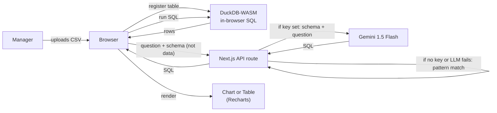

# Shipment Insights

A working prototype for the Code Brew Labs Technical PM task: an internal tool where a logistics manager uploads a CSV of shipment data and asks plain-English questions ("which routes had the most delays last month?") to get back a chart or a table.

> **Live demo:** https://shipment-insights.vercel.app
> **GitHub:** https://github.com/nidhishnandan15/shipment-insights
> **Loom walkthrough (4 min):** _[paste Loom URL after recording]_

## What it does

1. Manager drops a CSV (or clicks the sample dataset).
2. The CSV is loaded into an in-browser SQL engine (DuckDB-WASM) — no server upload, no provisioning.
3. Manager types a question in plain English.
4. The question is matched against a curated set of shipment-domain query patterns; the matching SQL is generated.
5. The query runs locally in DuckDB; the result is auto-rendered as a bar chart, line chart, or table depending on its shape.
6. The generated SQL is shown in a `<details>` panel so power users can audit what was run.

## Quick start

```bash
git clone https://github.com/nidhishnandan15/shipment-insights.git
cd shipment-insights
npm install
cp .env.example .env.local      # optional — paste a Gemini key for plain-English mode
npm run dev
```

Open http://localhost:3000 → click "Or try the sample dataset →" → ask a question.

A free Gemini key (no credit card) is at https://aistudio.google.com/apikey.

### Two modes

- **Without an API key:** the app falls back to a curated set of question patterns (delays by route, on-time rate, volume by city, etc.). The 3 example chips are guaranteed to work.
- **With a free Gemini key** (https://aistudio.google.com/apikey — Google login, no credit card): the app handles arbitrary plain-English questions by generating SQL from the schema.

The fallback exists so the demo never breaks if the LLM is down or unconfigured. The LLM exists so the tool actually does what the brief asks ("plain English"). Both paths run the SQL through the same DuckDB-WASM engine.

## Architecture



### Why this shape

| Concern | Choice | Why |
|---|---|---|
| Where does the CSV live? | **DuckDB-WASM in browser** | No server upload, no DB to provision, scales to ~1M rows on a laptop, zero cost per query |
| How does the question become SQL? | **LLM (Gemini Flash) with a curated-pattern fallback** | LLM handles arbitrary plain-English questions. Fallback ensures the demo works even with no key / network failure. Both paths funnel into the same DuckDB SQL execution |
| Schema vs data in the prompt | **Schema only — never the rows** | The LLM sees column names, types, and 3 sample rows. Real data stays in the browser. Cheap, private, scales |
| Output format | **Auto-picked: chart or table** | 1 categorical + 1 numeric column → bar chart. Date column → line chart. Otherwise → table |
| Auditability | **Generated SQL is visible** | Manager can see exactly what was run. No black box |
| Deployment | **Single Next.js app on Vercel** | One artifact, free hosting, public URL in 60 seconds |

### Why not feed the CSV to an LLM directly?

Three reasons that matter the moment this leaves a demo:

1. **Scale.** A real shipment CSV is 50K–10M rows. That blows past any LLM context window. Schema-only prompting works at any scale.
2. **Cost.** Tokens scale linearly with data. Schema prompts use ~500 tokens regardless of dataset size.
3. **Audit + correctness.** Numeric aggregation by an LLM is unreliable. Letting DuckDB do the math is deterministic and reproducible.

This is the standard "talk to your data" pattern that every modern BI tool (Tableau Pulse, Snowflake Cortex) uses.

## Supported question patterns

The demo handles questions about:

- **Delays by route** — "which routes had the most delays last month?"
- **Carrier performance** — "top carriers by on-time rate", "best carriers"
- **Volume by destination / origin** — "shipments per destination", "how many shipments per city"
- **Average delay per carrier** — "average delay days by carrier"
- **Status breakdown** — "shipment count by status"
- **Weight totals** — "weight by carrier", "heaviest shipments"

The 3 example chips on the homepage hit the most useful patterns directly. For arbitrary natural language, the production version would call an LLM (see `lib/llm.ts`).

## Project structure

```
app/
  page.tsx              # main UI (upload, query, results)
  api/query/route.ts    # NL→SQL endpoint
  layout.tsx
lib/
  duckdb.ts             # DuckDB-WASM bootstrap, CSV ingestion, query runner
  llm.ts                # NL→SQL: tries Gemini if GOOGLE_API_KEY set, falls back to curated patterns
  chart-picker.ts       # Heuristic: table vs bar vs line based on result shape
components/
  csv-upload.tsx        # Drag-drop + sample loader
  query-box.tsx
  example-chips.tsx     # 3 starter questions
  result-panel.tsx      # Renders chart + table + collapsible SQL
public/
  sample-shipments.csv  # 120 rows of fake shipment data
scripts/
  gen-sample-csv.mjs    # Regenerate sample CSV (deterministic seed)
```

## Sample dataset

`public/sample-shipments.csv` — 120 rows spanning the last 90 days.

Columns: `shipment_id, origin_city, destination_city, carrier, ship_date, deliver_date, status, delay_days, weight_kg, route_id`.

Carriers: FedEx, UPS, DHL, BlueDart. 8 origin/destination cities. 4 statuses (Delivered, Delayed, In Transit, Lost).

## Roadmap (cut from MVP, sized for the production version)

| Theme | Feature | Notes |
|---|---|---|
| Multi-tenant | Auth (NextAuth) + org-scoped data | Required day-one for a real B2B tool |
| Persistence | Move from in-browser DuckDB to Postgres / DuckDB on the server | Needed once datasets exceed browser memory |
| Integrations | Pull live data from TMS systems (SAP TM, Oracle OTM, Manhattan) | Eliminates the manual CSV step |
| Insights | Anomaly alerts on delay-rate spikes by route / carrier | Pushes the tool from "ask" to "tell me what's wrong" |
| Reports | Scheduled email digests (weekly / monthly) | High-value for ops directors who don't open dashboards |
| Governance | Row-level access (ops vs finance vs C-suite) | Compliance for sensitive contract data |
| Cross-CSV | Joins across multiple uploaded files (e.g. shipments + invoices) | Enables true reconciliation use-cases |
| Export | One-click PDF / PPT / Excel of any answer | Fits how managers actually share insights |

## Tech stack

- [Next.js 16](https://nextjs.org) (App Router) — single deployable
- [DuckDB-WASM](https://duckdb.org/docs/api/wasm/overview) — in-browser SQL engine
- [Google Gemini 1.5 Flash](https://aistudio.google.com) via `@google/generative-ai` — free tier, swappable
- [Recharts](https://recharts.org) — visualization
- [Tailwind CSS v4](https://tailwindcss.com)
- TypeScript

## Build story

Built in ~5 focused hours using Claude Code as the scaffolding partner. The interesting choices weren't writing the code — they were:

- choosing **schema-only prompting** over "feed the CSV to the LLM" (correctness + cost)
- choosing **DuckDB-WASM** over a server DB (zero infra, faster demo)
- making the **generated SQL visible to the user** (trust + audit)
- adding a **curated-pattern fallback** so the demo can't fail silently if the LLM key is missing or the network is down
- keeping **lib/llm.ts** as the single LLM integration point so swapping providers is a 3-line change

Each of these is a TPM judgment call before it's an engineering one — picking the right trade-off for a 12-hour build with a clear path to production rather than the most "complete" or most "AI-flashy" version.

---

Built for Code Brew Labs by Nidhish Nandan.
